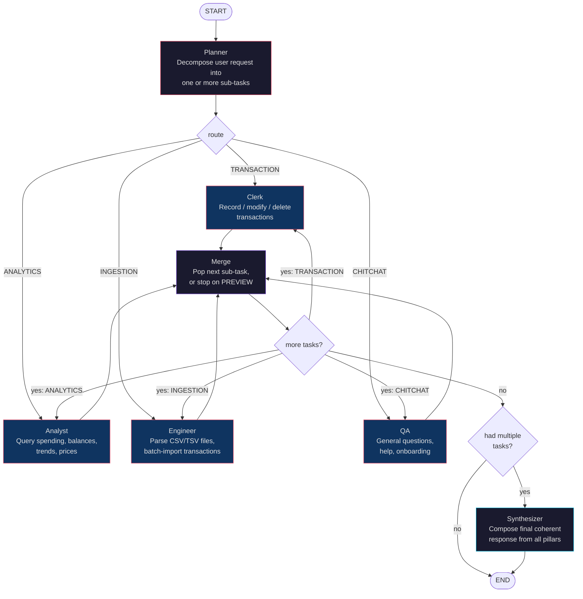

# Agent Core

[](https://python.org)
[](https://fastapi.tiangolo.com/)
[](https://langchain-ai.github.io/langgraph/)
[](https://beancount.github.io/)
[](./LICENSE)

**Stateless Beancount ledger agent — execution plane for personal finance AI.**

Agent Core is the open-source (GPL 2.0) execution plane of [BeanPilot](https://beanpilot.wbw1537.dev). It is a FastAPI HTTP server that receives per-request credentials and executes Beancount ledger operations (git clone, bean-check, LLM tool-calls, git push) in an ephemeral workspace. It holds no user state, no conversation history, and no database connections — it is purely an execution engine that returns results and destroys its workspace.

Agent Core can run standalone in **local mode** (your own machine, your own ledger, your own API key) or as a worker in **cloud mode** (receiving per-request tokens from an upstream dispatcher).

---

## Quick Start (Local Mode)

Run agent-core against a local Git repository — no cloud infrastructure needed.

### Prerequisites

- Python 3.11+
- `uv` (recommended) or `pip` + `venv`
- A local Git repository containing Beancount ledger files

### Setup

```bash
cd agent-core

# Install dependencies
uv sync

# Configure environment (copy and edit)
cp .env.example .env.local
```

Edit `.env.local`:

```env
AGENT_MODE=local
LOCAL_REPO_URL=/path/to/your/ledger/repo
OPENAI_API_KEY=sk-...
OPENAI_MODEL=deepseek-chat
OPENAI_BASE_URL=https://api.deepseek.com
```

### Run

```bash
uv run python -m agent_core.main --port 8000
```

Agent Core is now available at `http://localhost:8000`. Verify with:

```bash
curl http://localhost:8000/health
# {"status":"ok","version":"0.2.0","beancount":"3.0.0"}
```

---

## Local Mode vs Cloud Mode

Agent Core supports two mutually exclusive deployment modes, selected at startup by `AGENT_MODE`:

| | **Local Mode** (`AGENT_MODE=local`) | **Cloud Mode** (`AGENT_MODE=cloud`) |
|---|---|---|
| **Credential source** | Startup config (`LOCAL_REPO_URL`) | Per-request OAuth token |
| **Repository selection** | `LOCAL_REPO_URL` only; request `repo_url` is ignored | Request payload `repo.url` (HTTPS only) |
| **Git authentication** | None (bare local repository or accept-push config) | `GIT_ASKPASS` helper with short-lived token |
| **Token TTL** | N/A | ~1 hour, scoped to a single repository |
| **Typical use case** | Self-hosted: single user, their own API key, their own repo | Multi-tenant: per-request tokens from upstream dispatcher |
| **Blast radius** | Local filesystem | Contained to one user's ledger repo; container is ephemeral |

### Which mode should I use?

- **Local mode:** You're running agent-core on your own machine, for yourself, with your own ledger and API key. No external services needed.
- **Cloud mode:** Agent-core runs as an ephemeral worker receiving per-request tokens. It never holds credentials or secrets between requests.

In local mode, the running agent-core process ignores the `repo` field in incoming API requests and always operates on `LOCAL_REPO_URL`. This prevents a malicious or misconfigured client from redirecting Git operations to an unintended repository.

---

## Multi-Node Agent Workflow

Agent-core uses a **Planner → Pillar → Synthesizer** LangGraph architecture. Each chat turn passes through a pipeline of specialized nodes, each backed by a distinct LLM call with a dedicated persona and tool set.



### Nodes

| Node | Persona | LLM Role | Tools |
|------|---------|----------|-------|
| **Planner** | Task decomposer | Structured-output LLM → `PlannerOutput` | None (classification only) |
| **Clerk** | Data entry specialist | Clerk LLM + transaction tools | `preview_commit`, `confirm_commit`, `preview_open`, `confirm_open`, `preview_update`, `confirm_update`, `preview_bulk`, `confirm_bulk` |
| **Analyst** | Financial analyst | Analyst LLM + ledger read and market-data tools | `ledger_account_balance`, `ledger_find_transactions`, `ledger_query`, `ledger_fetch_price` |
| **Engineer** | Data pipeline engineer | Engineer LLM + ingestion tools | `ledger_ingest_file`, `ledger_run_python`, `preview_bulk`, `confirm_bulk` |
| **QA** | Onboarding assistant | QA LLM | None (chitchat only) |
| **Merge** | Control-flow router | Deterministic (no LLM) | Pops next sub-task or routes to synthesizer |
| **Synthesizer** | Response composer | Synthesizer LLM | None (weaves pillar outputs into one reply) |

### How a chat turn executes

1. **Planner** receives the user's query + recent conversation context and decomposes it into one or more sub-tasks. Each sub-task has a `route` (TRANSACTION / ANALYTICS / INGESTION / CHITCHAT) and a focused `task` description scoped only to that pillar's work.
2. The first sub-task is dispatched to its matching **Pillar**. The pillar replaces the user's original message with its scoped sub-task and invokes its LLM → tools → LLM loop.
3. When the pillar finishes, the **Merge** node checks for remaining sub-tasks. If another sub-task exists, it routes to the next pillar. If the last pillar returned a `PREVIEW` status (awaiting user confirmation), the pipeline stops immediately so the user can approve or reject.
4. Once all sub-tasks are complete and no PREVIEW is pending, the **Synthesizer** receives all pillar outputs and composes a single coherent response in the user's preferred language.
5. For single-task requests (most turns), the synthesizer is skipped — the pillar's output goes directly to the user.

This pipeline ensures the LLM operating on transactions never sees analytics tool signatures, the analyst never sees write-tool noise, and each persona receives only the context relevant to its job.

---

## API Reference

All endpoints except `/health` accept per-request credentials. Agent-core holds no authentication state between requests.

| Method | Path | Response | Description |
|--------|------|----------|-------------|
| `GET` | `/health` | JSON | Liveness check with version info |
| `POST` | `/agent/chat` | **SSE** (text/event-stream) | Full agent chat loop: preflight → LLM → tools → commit. Streams `data:` chunks ending with `[DONE]`. |
| `POST` | `/agent/stats` | JSON | Per-account spending totals scoped by conversation tag (BQL-backed) |
| `POST` | `/agent/accounts` | JSON | Valid account prefixes discovered from the ledger |
| `POST` | `/agent/conversation-title` | JSON | Lightweight LLM title generation for a new conversation |
| `POST` | `/agent/onboarding/discover` | JSON | Inspect a repository to determine what setup steps are needed (deterministic, no LLM) |
| `POST` | `/agent/onboarding/setup/preview` | JSON | Preview repository setup changes (initialize ledger or install sidecar include) |
| `POST` | `/agent/onboarding/setup/confirm` | JSON | Apply approved repository setup changes |
| `POST` | `/agent/run` | **SSE** | **Deprecated** — internally forwards to `/agent/chat` |

### SSE chunk format (`/agent/chat`)

Streamed JSON chunks separated by `\n\n`:

```json
{"type": "status", "content": "Cloning repository..."}
{"type": "require_user_input", "proposal_id": "abc123", "diff": "+2026-06-20 ..."}
{"type": "history_snapshot", "messages": [...]}
{"type": "fatal", "code": "INTERNAL_ERROR", "message": "..."}
```

The stream ends with `data: [DONE]\n\n`.

### Request shape (`POST /agent/chat`)

```json
{
  "repo": {
    "url": "https://github.com/user/ledger.git",
    "token": "ghs_xxxxxxxxxxxx"
  },
  "user_id": "usr_abc",
  "api_key": "sk-...",
  "model": "deepseek-chat",
  "query": "Record lunch, 85 CNY at Din Tai Fung",
  "conversation": {
    "id": "conv_abc",
    "tag": "conv_shanghai_trip",
    "account_whitelist": ["Expenses:Food:Dining"]
  },
  "messages": [{"role": "human", "content": "..."}],
  "ledger": {
    "entry_path": "data/main.beancount",
    "sidecar_main_path": "data/agent_inc/main.beancount",
    "sidecar_write_dir": "data/agent_inc"
  }
}
```

In local mode, `repo.url` and `repo.token` are ignored — agent-core always operates on `LOCAL_REPO_URL`.

---

## Environment Variables

| Variable | Required | Default | Description |
|----------|----------|---------|-------------|
| `AGENT_MODE` | **Yes** | — | `local` or `cloud` |
| `LOCAL_REPO_URL` | Local only | — | Path to local Git repository (required when `AGENT_MODE=local`) |
| `AGENT_HOST` | No | `0.0.0.0` | Server bind address |
| `AGENT_PORT` | No | `8000` | Server bind port |
| `OPENAI_API_KEY` | Local only | — | LLM API key (in cloud mode this is provided per-request) |
| `OPENAI_MODEL` | No | `gpt-4o` | Default LLM model name (overridable per-request) |
| `OPENAI_BASE_URL` | No | `https://api.openai.com/v1` | OpenAI-compatible API base URL |
| `WORKSPACE_TTL_SECONDS` | No | `900` | Clone cache TTL in seconds. `0` = no caching (fresh clone every request). `-1` = unlimited TTL (self-hosted). Recommended: `86400` (24h) for local mode, `900` (15m) for cloud mode. |
| `LANGFUSE_ENABLED` | No | `false` | Enable Langfuse LLM observability tracing |
| `LANGFUSE_HOST` | No | — | Langfuse host URL |
| `LANGFUSE_PUBLIC_KEY` | No | — | Langfuse public key |
| `LANGFUSE_SECRET_KEY` | No | — | Langfuse secret key |

---

## Docker

### Build

```bash
docker build -t agent-core .
```

### Run (cloud mode)

```bash
docker run -d \
  --name agent-core \
  -p 8000:8000 \
  -e AGENT_MODE=cloud \
  -e WORKSPACE_TTL_SECONDS=900 \
  agent-core
```

### Run (local mode, standalone)

```bash
docker run -d \
  --name agent-core \
  -p 8000:8000 \
  -e AGENT_MODE=local \
  -e LOCAL_REPO_URL=/data/ledger \
  -e OPENAI_API_KEY=sk-... \
  -e OPENAI_MODEL=deepseek-chat \
  -e WORKSPACE_TTL_SECONDS=86400 \
  -v /home/user/my-ledger:/data/ledger:rw \
  agent-core
```

### Docker Compose

A `deploy/compose.yml` template is available in the BeanPilot monorepo. Agent-core runs as the `agent-core` service, configured via `secrets.agent.*.env` and exposed on an internal network port 8000.

---

## Development

```bash
cd agent-core

# Install with dev dependencies
uv sync --dev

# Lint
uv run ruff check src/

# Type check
uv run mypy src/

# Run tests
uv run pytest src/agent_core/tests/ -v
```

### Architecture

Agent-core follows a **Deterministic-First** layered architecture:

```
API Layer (main.py)
  └── Pydantic validation, ContextVar lifecycle, SSE/JSON responses

Service Layer (services/)
  └── Deterministic: Git clone, bean-check, preflight, business logic

Agent Layer (agent.py)
  └── LangGraph state graph, intent routing, LLM calls, tool schemas

Tool Layer (thin @tool wrappers)
  └── Schema definitions → delegate to Service Layer
```

Operations computers handle well (Git, validation, file I/O) execute deterministically before any LLM is invoked. This ensures infrastructure failures are caught early with zero token cost.

### Key invariants

- Never writes outside `data/agent_inc/` in the ledger repo
- Two-phase commit: every write has separate `preview` and `confirm` phases
- `bean-check` after every write; auto-revert on failure
- `bean-format` before every `git commit`
- Token never stored to disk; passed through `GIT_ASKPASS` helper script
- Container destroyed after each request in cloud mode; zero persistent state

---

## License

Agent Core is free software licensed under the GNU General Public License v2.0. See [LICENSE](./LICENSE) for the full text.

The SaaS backend and frontend are proprietary — only agent-core is open source.
